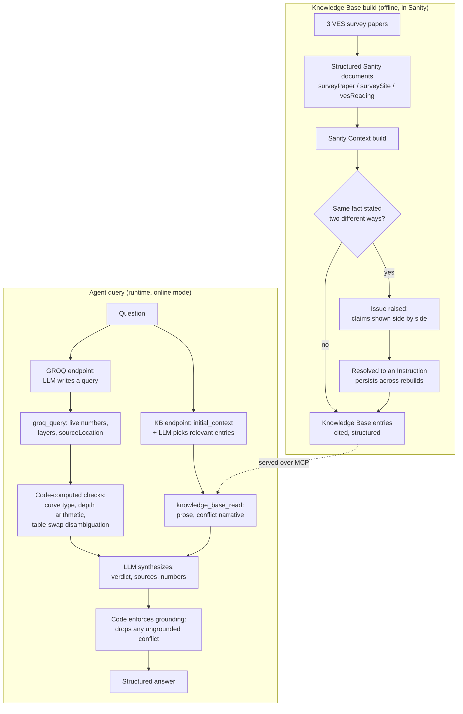

# VES Interpretation Agent

An agent that answers whether a groundwater resistivity reading is normal or anomalous for a specific Niger Delta drinking-water survey site, grounded in real, published Vertical Electrical Sounding (VES) papers, queried through [Sanity Context](https://www.sanity.io/docs/ai/sanity-context) over MCP.

Built for the [Sanity Challenge, Path One: Ship an Agent That Queries Real Content](https://dev.to/challenges/sanity-2026-09-16).

**Sanity project ID:** `c78nb8ch` (dataset `production`, public)
**Knowledge Base ID:** `kbIp9dbX1pcY`
**Model:** [Qwen](https://www.alibabacloud.com/en/product/modelstudio) (`qwen-plus`, via DashScope)

## The problem

The same resistivity reading means something different depending on the site's own history. A value that's normal at one location is a red flag at another. Field geologists checking this by hand have to cross-reference multiple published papers under time pressure, and those papers don't always agree with themselves.

## What makes this "only work because the content is structured"

Two real contradictions live in this dataset, not staged for the demo. Both were verified directly against the source PDFs:

1. **A same-paper table swap.** The Bori survey paper's own page-7 summary table prints two station names swapped against its own page-3 coordinate table and its own Figure 2 captions. A keyword search over the paper's text would return whichever row it happened to match, with no way to know the row is mislabeled. Sanity Context's build step caught this as a same-fact conflict once the two readings were ingested as separate structured entries; resolving it created a persistent [Instruction](https://www.sanity.io/docs/ai/sanity-context-resolve-issues) that survives future rebuilds. All 7 conflicts Context found and resolved while building this Knowledge Base are listed in [docs/conflicts-checklist.md](docs/conflicts-checklist.md).
2. **A label that contradicts its own data.** Three stations across two independent papers (Choba's site, Etche's Odufor and Opiro) are labeled "A-type curve" in their source paper, but their own transcribed resistivity layers dip partway through, not monotonically increasing, which is what "A-type" actually requires. Catching this needs the raw numeric layer array, not the paper's prose label -- computed in code by [`agent/curveType.js`](agent/curveType.js), not left to the model to eyeball.

An eval comparing this agent against a plain BM25 keyword-search baseline over the raw paper text (same model, same general prompt shape, no structure) found the structured agent scoring 100% on both verdict and conflict-detection accuracy across 9 questions x 3 reps, against 56% / 85% for the baseline -- see [Eval results](#eval-results) below.

## Project layout

```
studio/     Sanity Studio: schema for surveyPaper / surveySite / vesReading
seed/       Scripts that transcribe the real papers into structured Sanity documents
agent/      The querying agent (Node, MCP client + Qwen for reasoning)
eval/       Structured-vs-baseline evaluation harness and results
examples/   Real, complete example outputs with every tool call shown
docs/       The Phase 6 conflicts checklist
```

## Reproducing this

1. **Studio + schema**: `cd studio && npm install && npm run dev`. Schema lives in `studio/schemaTypes/`.
2. **Seed the dataset**:
   ```bash
   node seed/build-ndjson.js
   node seed/verified-corrections.js
   cd studio
   npx sanity dataset import ../seed.ndjson production
   npx sanity dataset import ../verified-corrections.ndjson production --replace
   ```
3. **Deploy the Studio app** (required for the GROQ MCP endpoint's schema access): `cd studio && npx sanity deploy`.
4. **Create two Context MCP endpoints** in the Dashboard (`sanity.io` → your org → Context, separate from `sanity.io/manage`):
   - One serving your **Knowledge Base** (`New knowledge base` → add the `production` dataset as a source, with `surveyPaper`/`surveySite` reference unfolding enabled on `vesReading` → Build entries → resolve any Issues it raises → then `New endpoint` pointed at that knowledge base).
   - One serving the **dataset directly** (`New endpoint` → Content source: Dataset → your project/`production`), which is what makes it GROQ mode.
5. **Create an org API token** with **Context Viewer** permission (`Manage → API → Tokens`).
6. **Run the agent**:
   ```bash
   cp .env.example .env   # fill in your token, KB id, both MCP URLs, Qwen key
   node agent/index.js "I got a 2950 ohm-m reading at BMGS Bori Field. Is that normal or anomalous, and can I trust it?"
   ```
   Verify both endpoints are wired correctly with `bash scripts/check-endpoints.sh`.

## How the agent works



1. Writes and runs a GROQ query against the live dataset for the station/site in question (max one bounded retry, then a deterministic code-built fallback) -- numbers, layers, and `sourceLocation` come only from here.
2. In parallel, picks and reads the relevant Knowledge Base entries for prose explanation and conflict narrative.
3. Runs three code-computed checks against the GROQ data before the model ever sees it as a fact to narrate, not derive:
   - **Curve type** (`agent/curveType.js`): derives A/Q/H/K from the raw layer resistivities and compares to the paper's published label.
   - **Depth arithmetic** (`agent/depthArithmetic.js`): checks each layer's printed cumulative depth against prior depth + thickness, tolerant of ordinary rounding but not a multi-meter transcription error.
   - **Table-swap disambiguation** (`agent/tableSwap.js`, used in `--public` mode): when two documents disagree on the same station's value, resolves which one is trustworthy by rule rather than leaving the model to reason it out from citation text (which was tested and found unreliable without Knowledge Base grounding -- see [examples/bori-demo.md](examples/bori-demo.md)).
4. Synthesizes a verdict-first answer: plain-language call first, sources second, raw numbers last, grounded only in what was retrieved.
5. `agent/grounding.js`'s `enforceGrounding()` scans the synthesized answer afterward and drops any conflict block citing a number not present in the GROQ data -- a fabricated conflict was found and fixed this way during testing (see the Phase 4/5 commit history).

## Curve type and depth checks

`agent/curveType.js` and `agent/depthArithmetic.js` are pure functions, unit tested against both synthetic cases and real layer values read live from the dataset:

```bash
cd agent
npm test
```

17 tests, covering the A/Q/H/K classification (including the multi-layer "AAA collapses to a match" and "KHA never matches A" cases) and the depth-arithmetic tolerance (calibrated against real data: a clean station has up to ~0.3 m of ordinary rounding noise, while a real transcription error is off by ~7 m).

## Modes

| | Command | Network | Knowledge Base | LLM |
|---|---|---|---|---|
| Online (default) | `node agent/index.js "..."` | Yes, needs a token | Yes | Yes |
| `--public` | `node agent/index.js --public "..."` | Yes, no token (dataset must be public) | No | Yes |
| `--offline` | `node agent/index.js --offline "..."` | None at all | No | No -- rule-based |

`--offline` loads a committed local snapshot (`agent/offline-snapshot.ndjson`) and runs the same GROQ query text via [groq-js](https://github.com/sanity-io/groq-js) locally, with a rule-based verdict (normal / anomalous / label mismatch) instead of an LLM synthesis. Refresh the snapshot with `bash scripts/refresh-offline-snapshot.sh` (needs a one-time `npx sanity login`). `eval/compare-offline.js` checks `--offline` against the online agent on all 9 eval questions: 8/9 agree exactly, and the one disagreement is a disclosed, inherent trade-off of having no language understanding, not a bug -- see [eval/results/offline-vs-online--2026-09-26.md](eval/results/offline-vs-online--2026-09-26.md).

## Eval results

9 questions, 3 reps per condition, structured agent vs. a plain BM25 keyword-search baseline over the raw text of the three source PDFs (same model, comparable prompt, no structure):

| | Structured (agent) | Baseline (BM25 keyword search) |
|---|---|---|
| Verdict accuracy | 27/27 (100%) | 15/27 (56%) |
| Conflict-detection accuracy | 27/27 (100%) | 23/27 (85%) |
| Run-to-run consistency | Perfect on all 9 questions | -- |

Full scorecard: [eval/results/scorecard--2026-09-26.md](eval/results/scorecard--2026-09-26.md). Questions and expected answers: [eval/questions.json](eval/questions.json). Real, complete example transcripts with every tool call: [examples/](examples/).

## Data sources

Real, cited, DOI-linked VES survey papers, transcribed into **3 papers, 3 sites, 24 station readings** (10 Knowledge Base entries, well under the 150-entry limit):

- Menegbo, Davies & Horsfall (2024), Bori Metropolis: [doi.org/10.30574/wjarr.2024.24.2.3293](https://doi.org/10.30574/wjarr.2024.24.2.3293)
- Oghonyon, Nnurum & Oguejiofor (2025), Choba: [doi.org/10.51244/IJRSI.2025.120700155](https://doi.org/10.51244/IJRSI.2025.120700155)
- Nwankwoala, Osayande, Nwosu & Ugwu (2022), Etche LGA: [doi.org/10.30574/gjeta.2022.11.1.0070](https://doi.org/10.30574/gjeta.2022.11.1.0070)
