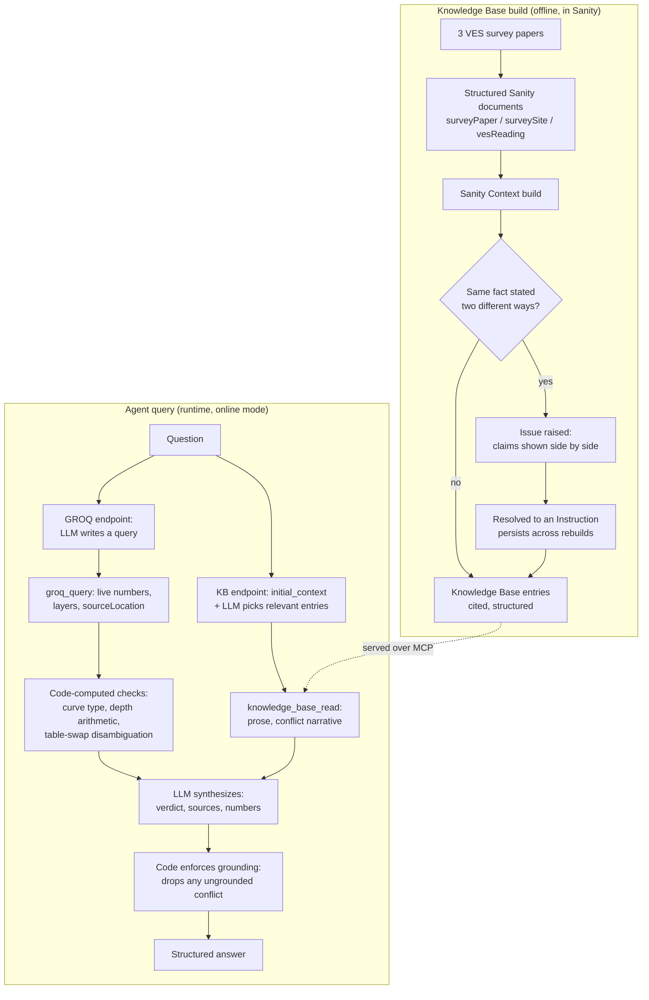

# VES Interpretation Agent

An agent that answers whether a groundwater resistivity reading is normal or anomalous for a specific Niger Delta drinking-water survey site, grounded in real, published Vertical Electrical Sounding (VES) papers, queried through [Sanity Context](https://www.sanity.io/docs/ai/sanity-context) over MCP.

Built for the [Sanity Challenge, Path One: Ship an Agent That Queries Real Content](https://dev.to/challenges/sanity-2026-09-16).

**Sanity project ID:** `c78nb8ch` (dataset `production`, public)
**Knowledge Base ID:** `kbIp9dbX1pcY`
**Model:** [Qwen](https://www.alibabacloud.com/en/product/modelstudio) (`qwen-plus`, via DashScope)

**[Try it live: ves-interpretation-agent.vercel.app](https://ves-interpretation-agent.vercel.app)**, no login or setup needed. A static findings page lists all 10 internal inconsistencies; an ask page runs the same rule-based `--offline` mode as the CLI below, live, with example questions ready to click. Source: [`web/`](web/) and [`api/ask.js`](api/ask.js), which calls `agent/index.js --offline` as an unmodified child process, so the deployed page and the CLI can never give different answers.

## The problem

The same resistivity reading means something different depending on the site's own history. A value that's normal at one location is a red flag at another. Field geologists checking this by hand have to cross-reference multiple published papers under time pressure, and those papers don't always agree with themselves.

## What makes this "only work because the content is structured"

**10 internal inconsistencies live in this dataset across 3 published papers, not 3 and not staged for the demo.** All 10 are PDF-verified with exact page/table citations in [docs/conflicts-checklist.md](docs/conflicts-checklist.md) (Table B); the 3 below are the headline examples this README and the demo walk through:

1. **A same-paper table swap.** The Bori survey paper's own page-7 summary table prints two station names swapped against its own page-3 coordinate table and its own Figure 2 captions. A keyword search over the paper's text would return whichever row it happened to match, with no way to know the row is mislabeled. Sanity Context's build step caught this as a same-fact conflict once the two readings were ingested as separate structured entries; resolving it created a persistent [Instruction](https://www.sanity.io/docs/ai/sanity-context-resolve-issues) that survives future rebuilds.
2. **A label that contradicts its own data.** Three stations across two independent papers (Choba's site, Etche's Odufor and Opiro) are labeled "A-type curve" in their source paper, but their own transcribed resistivity layers dip partway through, not monotonically increasing, which is what "A-type" actually requires. Catching this needs the raw numeric layer array, not the paper's prose label. This is computed in code by [`agent/curveType.js`](agent/curveType.js), not left to the model to eyeball.
3. **Egwi layer 4 is inconsistent in both Table 1 and the Figure 2 text.** The Etche paper's own Table 1 prints layer 3's cumulative depth as 6.2935 m and layer 4's thickness as 37.957 m, which sums to 44.2505 m, but the same table prints layer 4's cumulative depth as 37.25 m. Layers 1-3 for the same station reconcile to within rounding (confirming the check is exact, not noisy), and only layer 4 fails. The paper's own prose describing Figure 2 repeats both numbers again (`eval/paper-text/etche.txt`), but that doesn't prove either one correct: the prose plausibly just restates Table 1, so it's one source stated twice, not independent confirmation. What it does establish is that the inconsistency is in the authors' own reported values, not a single print typo. The thickness and the depth cannot both be correct, and **the paper does not give enough information to decide which one is wrong**. Resolving that would need the raw field data (AB/2 spacing vs. apparent resistivity) to re-run the inversion, out of scope here; noted as future work. Caught and reported by `agent/depthArithmetic.js`.

The other 7 (2 more Etche curve-type mislabels, 5 more Etche depth-arithmetic inconsistencies) are the same two kinds of finding at different stations; see Table B in the checklist for all 10 with exact citations.

Sanity Context's own conflict detector raised 14 Issues while building this Knowledge Base, across several rebuilds. 6 of those 14 pointed to real errors (covering 3 of the 10 internal inconsistencies: the Bori swap, the Choba mislabel, and the Etche Odufor mislabel); same-fact detection is what catches a case like the Bori swap, where two structured entries state different numbers for the same station. The other 7 internal inconsistencies (Etche's Opiro curve-type mislabel and all 6 Etche depth-arithmetic cases) need a derived computation instead (is this sequence monotonic? does this depth reconcile with the prior depth plus thickness?), which is outside what same-fact conflict detection checks for, so this project's own code runs those checks at query time. Full breakdown, including a measurement of what Context's detector does and doesn't catch on this dataset, in [docs/conflicts-checklist.md](docs/conflicts-checklist.md) (Table A + B).

An eval comparing this agent against a plain BM25 keyword-search baseline over the raw paper text (same model, same general prompt shape, no structure) found the structured agent scoring 100% on both verdict and conflict-detection accuracy across 9 questions x 3 reps, against 56% / 85% for the baseline. **Those 9 questions were known during development and are not a held-out test.** See [Eval results](#eval-results) below for what that means and what's being done about it.

## Project layout

```
studio/     Sanity Studio: schema for surveyPaper / surveySite / vesReading
seed/       Scripts that transcribe the real papers into structured Sanity documents
agent/      The querying agent (Node, MCP client + Qwen for reasoning)
eval/       Structured-vs-baseline evaluation harness and results
examples/   Real, complete example outputs with every tool call shown
docs/       The Phase 6 conflicts checklist
web/        Static demo site (findings page + ask page), deployed to Vercel
api/        ask.js, a Vercel Node function that calls agent/index.js --offline
            as a child process; no agent/ code is imported or changed
```

`package.json` at the repo root has no real dependencies; it exists only so Vercel's
default install step has something to run. Real dependencies live in `agent/package.json`,
installed separately by `vercel.json`'s `buildCommand`.

## Reproducing this

1. **Studio + schema**: `cd studio && npm install && npm run dev`. Schema lives in `studio/schemaTypes/`.
2. **Seed the dataset**:
   ```bash
   node seed/build-ndjson.js
   node seed/verified-corrections.js
   cd studio
   npx sanity dataset import ../seed.ndjson production
   npx sanity dataset import ../verified-corrections.ndjson production --replace
   ```
3. **Deploy the Studio app** (required for the GROQ MCP endpoint's schema access): `cd studio && npx sanity deploy`.
4. **Create two Context MCP endpoints** in the Dashboard (`sanity.io` → your org → Context, separate from `sanity.io/manage`):
   - One serving your **Knowledge Base** (`New knowledge base` → add the `production` dataset as a source, with `surveyPaper`/`surveySite` reference unfolding enabled on `vesReading` → Build entries → resolve any Issues it raises → then `New endpoint` pointed at that knowledge base).
   - One serving the **dataset directly** (`New endpoint` → Content source: Dataset → your project/`production`), which is what makes it GROQ mode.
5. **Create an org API token** with **Context Viewer** permission (`Manage → API → Tokens`).
6. **Run the agent**:
   ```bash
   cp .env.example .env   # fill in your token, KB id, both MCP URLs, Qwen key
   node agent/index.js "I got a 2950 ohm-m reading at BMGS Bori Field. Is that normal or anomalous, and can I trust it?"
   ```
   Verify both endpoints are wired correctly with `bash scripts/check-endpoints.sh`.

## How the agent works


```mermaid
flowchart TD
    subgraph Build["Knowledge Base build (offline, in Sanity)"]
        A["3 VES survey papers"] --> B["Structured Sanity documents<br/>surveyPaper / surveySite / vesReading"]
        B --> C["Sanity Context build"]
        C --> D{"Same fact stated<br/>two different ways?"}
        D -->|yes| E["Issue raised:<br/>claims shown side by side"]
        E --> F["Resolved to an Instruction<br/>persists across rebuilds"]
        D -->|no| G["Knowledge Base entries<br/>cited, structured"]
        F --> G
    end

    subgraph Query["Agent query (runtime, online mode)"]
        H["Question"] --> I["GROQ endpoint:<br/>LLM writes a query"]
        I --> J["groq_query: live numbers,<br/>layers, sourceLocation"]
        H --> K["KB endpoint: initial_context<br/>+ LLM picks relevant entries"]
        K --> L["knowledge_base_read:<br/>prose, conflict narrative"]
        J --> M["Code-computed checks:<br/>curve type, depth arithmetic,<br/>table-swap disambiguation"]
        M --> N["LLM synthesizes:<br/>verdict, sources, numbers"]
        L --> N
        N --> O["Code enforces grounding:<br/>drops any ungrounded conflict"]
        O --> P["Structured answer"]
    end

    G -. served over MCP .-> L
```

1. Writes and runs a GROQ query against the live dataset for the station/site in question (max one bounded retry, then a deterministic code-built fallback). Numbers, layers, and `sourceLocation` come only from here.
2. In parallel, picks and reads the relevant Knowledge Base entries for prose explanation and conflict narrative.
3. Runs three code-computed checks against the GROQ data before the model ever sees it as a fact to narrate, not derive:
   - **Curve type** (`agent/curveType.js`): derives A/Q/H/K from the raw layer resistivities and compares to the paper's published label.
   - **Depth arithmetic** (`agent/depthArithmetic.js`): checks each layer's printed cumulative depth against prior depth + thickness, tolerant of ordinary rounding but not a multi-meter inconsistency. When it fires, `depthInconsistencyStatement()` generates the finding as a fixed template in code and the model's own headline/explanation for that fact are overwritten with it, not left to the model to word (see [Limitations](#limitations) for why prompt instructions alone weren't reliable enough).
   - **Table-swap disambiguation** (`agent/tableSwap.js`, used in `--public` mode): when two documents disagree on the same station's value, resolves which one is trustworthy by rule rather than leaving the model to reason it out from citation text, which was tested and found unreliable without Knowledge Base grounding (see [examples/bori-demo.md](examples/bori-demo.md)). The rule itself is general (grouped by whatever `station` value is in the data, not hardcoded to any station name), but it has only ever been exercised against one real swap pattern in this dataset; see [Limitations](#limitations).
4. Synthesizes a verdict-first answer: plain-language call first, sources second, raw numbers last, grounded only in what was retrieved.
5. `agent/grounding.js`'s `enforceGrounding()` scans the synthesized answer afterward and drops any conflict block citing a number not present in the GROQ data. A fabricated conflict was found and fixed this way during testing; see [Limitations](#limitations).

## Curve type and depth checks

`agent/curveType.js` and `agent/depthArithmetic.js` are pure functions, unit tested against both synthetic cases and real layer values read live from the dataset:

```bash
cd agent
npm test
```

22 tests, covering the A/Q/H/K classification (including the multi-layer "AAA collapses to a match" and "KHA never matches A" cases) and the depth-arithmetic tolerance (0.5 m, chosen after inspecting every documented case across both sites: a clean station shows up to 0.300 m of ordinary rounding noise, and the 6 confirmed internal inconsistencies range from 0.795 m to ~11.0 m; see [Limitations](#limitations) for the first tolerance value, which missed the smallest of those).

## Modes

| | Command | Network | Knowledge Base | LLM |
|---|---|---|---|---|
| Online (default) | `node agent/index.js "..."` | Yes, needs a token | Yes | Yes |
| `--public` | `node agent/index.js --public "..."` | Yes, no token (dataset must be public) | No | Yes |
| `--offline` | `node agent/index.js --offline "..."` | None at all | No | No, rule-based |

`--offline` loads a committed local snapshot (`agent/offline-snapshot.ndjson`) and runs the same GROQ query text via [groq-js](https://github.com/sanity-io/groq-js) locally, with a rule-based verdict (normal / anomalous / label mismatch) instead of an LLM synthesis. Refresh the snapshot with `bash scripts/refresh-offline-snapshot.sh` (needs a one-time `npx sanity login`). `eval/compare-offline.js` checks `--offline` against the online agent on all 9 eval questions: 8/9 agree exactly, and the one disagreement is a disclosed, inherent trade-off of having no language understanding, not a bug. See [eval/results/offline-vs-online--2026-09-26.md](eval/results/offline-vs-online--2026-09-26.md).

## Eval results

9 questions, 3 reps per condition, structured agent vs. a plain BM25 keyword-search baseline over the raw text of the three source PDFs (same model, comparable prompt, no structure):

| | Structured (agent) | Baseline (BM25 keyword search) |
|---|---|---|
| Verdict accuracy | 27/27 (100%) | 15/27 (56%) |
| Conflict-detection accuracy | 27/27 (100%) | 23/27 (85%) |
| Run-to-run consistency | Perfect on all 9 questions | N/A |

Full scorecard: [eval/results/scorecard--2026-09-26.md](eval/results/scorecard--2026-09-26.md). Questions and expected answers: [eval/questions.json](eval/questions.json). Real, complete example transcripts with every tool call: [examples/](examples/).

**These 9 questions are not a held-out test, and the 27/27 score should be read accordingly.** Claude (the coding agent used to build this project) drafted `eval/questions.json`, which Daniel then reviewed and approved. The system was then iteratively debugged against these same questions: `agent/tableSwap.js` exists specifically because running the Bori swap question through `--public` mode surfaced a real bug (see [Limitations](#limitations)), and the same question is in the scored set. A perfect score on questions the system was fixed against demonstrates that it works on the cases it was built for. It does not demonstrate generalization.

**Held-out results.** Daniel wrote and ran these questions himself, unseen by Claude beforehand, against the final Phase 8 system:

- A Pidgin-phrased Choba question ("wetin be choba reading") answered correctly, catching the curve-type mismatch.
- A specific-station Etche question with correct expected reasoning worked correctly.
- **A broad, unscoped question with a claimed value that didn't match any station** ("is 1000 ohm-m normal for Etche?", no station named) exposed a real bug: the online agent's answer was completely hijacked by an unrelated station's depth-arithmetic finding, silently ignoring the actual question and the claimed number entirely. Root cause and fix below.
- **The same question in `--public` mode** exposed a second, separate bug: a low-level Node crash on an unresolvable site query. Root cause and fix below.
- **A named-station Bori question** (Maakoro-street) answered correctly, matching the published value exactly, no fabricated conflict for a station with none.
- **A cross-site comparison question** ("between Maakoro-street and Akpoku, which has higher resistivity") exposed a third bug: the model got the comparison direction backwards in the headline on 4 of 5 repeated runs, sometimes visibly self-correcting mid-explanation, sometimes silently wrong with no signal at all. Root cause and fix below.

All three were fixed and re-verified before this section was written; see [Limitations](#limitations) for exactly what was wrong and how each was confirmed fixed.

**A second held-out run, after the depth-arithmetic tolerance fix.** The same 4 questions above were re-run against the code once the tolerance fix started correctly catching Etche's Akpoku station (see Limitations). 3 of 4 passed unchanged. The fourth, the cross-site comparison question, failed on this run: it now named a station (Akpoku) with a real depth-arithmetic finding, and the override meant to state that finding overwrote the entire comparison answer instead of leaving it alone. Fixed by gating the override against comparison questions (see Limitations for the detail); re-run after the fix, all 4 of 4 passed.

## Limitations

Real failures found during development, not smoothed over:

- **The depth-arithmetic tolerance missed a real inconsistency, and the fix is disclosed explicitly here.** Verifying the "3 real errors" claim in this README against the actual PDF (prompted by an external review asking for exact, consistent counts) meant independently checking all 10 confirmed internal inconsistencies by hand, not just the 2 originally tested (Egwi, and Bori's Court-road as the clean control). That check found Etche's Akpoku station has a genuine internal inconsistency of 0.795 m, confirmed against the raw PDF text, that the original 1.0 m tolerance was too loose to catch, a false negative. The 0.5 m tolerance now in use was chosen only after inspecting every known case across both sites: a clean station (Bori's Court-road) shows at most 0.300 m of ordinary rounding noise, and the smallest confirmed internal inconsistency is 0.795 m (Akpoku); 0.5 m sits cleanly between the two. The comparison question re-run below, which touches Akpoku, is the first held-out test this tolerance value has been through, and it passed. 5 new regression tests added (Ulakwo, Okehi, Akpoku, Ndashi, Umuokom), all read directly from the extracted PDF text.

- **A held-out question hijacked the answer with an unrelated station's finding.** "Is 1000 ohm-m normal for Etche?" (no station named) returned a whole site's worth of data, which had 5 different depth-arithmetic issues in it. `applyDepthInconsistencyOverride()` picked one via a weak tie-break and overwrote the entire answer with that station's template, never engaging with the actual claimed number (1000 ohm-m) or acknowledging the question named no station. Fixed by gating the override: it now only fires when there's exactly one candidate, or the best-matching station's name actually overlaps the question's wording; otherwise it's left alone and the model's own synthesis (now correctly reasoning about the claim) is used. Re-run after the fix: verdict `uncertain`, correctly states no Etche station reports 1000 ohm-m, gives the real range (77.6-5776 ohm-m). The identical gating bug existed in `--public`'s table-swap override too (same tie-break pattern) and was fixed the same way, though it hadn't yet been observed failing in practice.
- **The station-name gate above wasn't enough by itself.** Re-running the held-out questions after the depth-arithmetic tolerance fix (Etche's Akpoku now correctly flagged, see above) exposed a second case: "Between Maakoro-street and Akpoku, which has higher resistivity?" names Akpoku, so the token-overlap gate matched and let the override fire, overwriting the entire answer with Akpoku's depth-inconsistency template even though `fixComparisonClaim()`, running just before it, had already computed the correct comparison headline. A comparison question needs a comparison answer regardless of whether the named station also has an unrelated documented issue. Fixed with a second gate, `isComparisonQuestion()`, checked before both `applyDepthInconsistencyOverride()` and (in `--public`) `applyTableSwapOverride()`: it detects comparison phrasing ("between X and Y", "compare", "versus", "which ... higher/lower") in the question itself and skips the override entirely when present. Re-run after the fix: correct verdict `normal`, headline "Maakoro-street has lower resistivity than Akpoku: 1109 ohm-m versus 2200.9 ohm-m," and a direct single-station question about Akpoku's own depth arithmetic still triggers the override normally, confirming the new gate only blocks comparison questions, not the case it was originally built for.
- **`--public` mode crashed on an unresolvable question** instead of exiting cleanly (`Assertion failed: !(handle->flags & UV_HANDLE_CLOSING)`, a Windows libuv issue triggered by `process.exit()` forcing termination while a fetch's handle was still closing). Fixed by using `process.exitCode` instead of `process.exit()` in the CLI's fatal-error handler, letting the event loop drain naturally. Verified: same failing command now exits cleanly with code 1 and no crash.
- **`--public` mode's site resolver is more brittle than the online agent's** for loose or abbreviated phrasing. Online mode has an LLM write the GROQ query and can fuzzy-match "etch" to "Etche LGA survey stations" on its own; `--public` uses a purely mechanical token-overlap resolver (no LLM involved in that step, by design, since `--public` has no Knowledge Base access to ground one), and "etch" shares no exact normalized token with "etche," so resolution fails outright rather than guessing. Not fixed; documented here as a known gap in `--public` specifically, lower priority since the main online agent handles it fine.
- **Cross-site comparison questions got the direction backwards, often silently.** Asked which of two named stations had higher resistivity, the model stated the wrong one in the headline on 4 of 5 repeated runs. Sometimes it visibly caught itself mid-explanation ("...2200.9 ohm-m -- wait, no: 2200.9 is higher than 1109...") with the headline, generated earlier, left uncorrected; other times it was simply wrong with no self-correction text at all, so a first fix (retrying on detected self-correction language) only caught the visible cases. Comparison claims aren't a closed, pre-computable class the way curve type / table swap / depth arithmetic are, so there's no fixed fact to hand the model up front. What can be checked is the headline's own claimed direction, parsed and verified against the GROQ data after the fact. `fixComparisonClaim()` does exactly that: matches the two station names in a "X has higher/lower ... than Y" headline against the retrieved rows, and rewrites the headline if the claimed direction contradicts the actual values. Re-verified across 5 repeated runs: the underlying model error rate didn't change (~4/5), but the final output was correct 5/5 after the code-side check.

- **`--public` mode once reversed the flagship conclusion.** Asked about the same 2950 ohm-m Bori reading, `--public` (no Knowledge Base access) answered ANOMALOUS and claimed the value "actually belongs to Kenpoly," the exact opposite of the correct resolution, 3 times in a row, even after adding an explicit rule to the prompt. Fixed by computing the disambiguation in code (`agent/tableSwap.js`) instead of trusting the model's prose reasoning. See [examples/bori-demo.md](examples/bori-demo.md).
- **The model fabricated a conflict once**, for Kenpoly Convocation Arena, by borrowing a number from a different, similarly-named station's real documented issue. `agent/grounding.js`'s `enforceGrounding()` now scans conflict claims for numbers absent from the retrieved data and drops the conflict if found.
- **`--offline` disagrees with the online agent on 1 of 9 questions**, by design: it has no language understanding, so it can't tell that a question about depth arithmetic isn't asking about an unrelated curve-type issue at the same station, and surfaces both. See [eval/results/offline-vs-online--2026-09-26.md](eval/results/offline-vs-online--2026-09-26.md).
- **`agent/tableSwap.js`'s rule is structurally general** (it groups by whatever `station` value is in the retrieved data and has no hardcoded station names or resistivity values), **but it has only been exercised against one real swap pattern** in this dataset. It has not been tested against a different kind of same-station disagreement.
- **A Knowledge Base entry overclaims its own scope.** `station_readings/bori/high_resistivity_stations` states "all eight" Bori stations exceed 1000 ohm-m, true only of the curated subset that entry covers; 5 other Bori stations are well below that. The online agent's prompt now warns against repeating this kind of claim past its actual scope, but the entry's own text still asserts it. This is a content fix for Phase 8, not something prompt engineering alone reliably prevents. See [examples/bori-demo.md](examples/bori-demo.md).
- **The 9 eval questions are not held-out**, as covered above.
- **A Knowledge Base rebuild resolved a non-conflict as if it were real (issue #4), and the instruction it created has since been fixed.** Two genuinely different, correctly-labeled stations (Kenpoly Convocation Arena and Kenpoly sec school field) got paired as competing claims purely because both names contain "Kenpoly," the exact confusion the agent's own code once made (see above). The standing Instruction this created stated the wrong value for Kenpoly sec school field (3488 Ω·m, actually Convocation Arena's number). Screenshotted as evidence, then deleted on 2026-09-29; deleting it reopened the underlying Issue in its correct, non-paired form (the `normalcy_verdicts` entry's number vs. Kenpoly sec school field's own source reading), which was resolved keeping the true value (3706 Ω·m). After the rebuild, the 3 eval questions touching these two stations were re-run live: all 3 verdicts and trusted values came back unchanged from before the fix. This is also a genuine finding about Sanity Context's own conflict detector, not just a bug: of the 14 Issues it has raised in this Knowledge Base across all rebuilds, 6 pointed to real errors; the rest needed derived checks the same-fact detector doesn't run (see [docs/conflicts-checklist.md](docs/conflicts-checklist.md) Table A), and this one shows the detector's same-fact-pairing logic can be fooled by name similarity alone, the same failure mode the agent's own early code had to be fixed for independently.
- **Rebuilding the Knowledge Base (e.g. after a purpose-text change) can introduce its own fresh errors**, independent of the source PDFs. Applying the Phase 8 purpose text triggered a rebuild that regenerated the entries and introduced 3 new bugs (a station's numbers bleeding into a different station's section, the same Kenpoly-name confusion the agent's own code once made, and a missing value read as a false conflict), all caught by Context's own Issue detector before reaching the agent, none of them genuine inconsistencies in the source papers. See [docs/conflicts-checklist.md](docs/conflicts-checklist.md) issues #9-#11.
- **The depth-arithmetic check existed but was never wired into the online agent.** Unlike curve type, which was code-computed from the start, depth arithmetic was only added to `--offline`. The online agent reasoned about it purely from raw numbers with no code-computed fact to anchor it, and its first real answer said the printed depth "is wrong by about 7 meters," asserting a winner the paper doesn't support. Tightening the prompt (twice) reduced but didn't eliminate wording that leaned toward one number. The fix that actually worked: stop asking the LLM to word this at all. `agent/depthArithmetic.js`'s `depthInconsistencyStatement()` generates the finding as a fixed template in code, and the online/`--public` pipelines overwrite the model's headline and explanation with it after the fact, the same pattern already used for the table-swap fix. Verified byte-identical across repeated runs in all three modes.
- **Code freeze was declared, then broken once, for a real bug a clean-clone test found.** After freezing the code at commit `802cb49`, testing the exact commands from the submission post against a real clean clone (`git clone` into a fresh directory, not this working copy) found that every mode crashed with `ENOENT: no such file or directory, open '.../.env'`. `agent/mcp.js`'s `loadEnv()` used `fs.readFileSync` unconditionally at module load time, and `agent/index.js` requires that module before it even checks `--offline`/`--public`, so a fresh clone with no `.env` file (correctly gitignored) crashed on every invocation, including `--offline`, which is supposed to need zero keys. Fixed with the minimal possible change: `loadEnv()` now returns `{}` instead of throwing when `.env` doesn't exist, and nothing else in `agent/` changed. Online and `--public` mode now fail with one clear message instead ("Missing keys: ... See .env.example, or run with --offline.") rather than a cryptic crash or an `undefined` sent to an API. Re-verified: `npm test` (22/22), all three modes locally, and `eval/compare-offline.js` (8/9 agreement, same known disagreement as before) all pass unchanged; a second real clean-clone test with the exact commands from the post now runs `--offline` correctly with no `.env` present at all. New frozen commit: see the latest commit on `main`.
- **A Knowledge Base rebuild is not a stable, one-time operation.** While recording video footage for this submission on 2026-09-30, resolving one Issue's standing instruction and rebuilding surfaced a fresh Issue, three times in a row (a re-surfaced instance of the Bori swap, then Context catching the Etche Odufor curve-type mislabel for the first time, then another adjacent-station data bleed on BMGS Bori Field's thickness), before a rebuild finally came back with 0 pending. Each was checked against the PDFs with the same rigor as every prior Issue; see [docs/conflicts-checklist.md](docs/conflicts-checklist.md) issues #12-#14. The Knowledge Base entry count changed too, from 11 to 8, with different entry names, purely from rebuilding, not from any content change. The agent kept working correctly throughout, since `selectPaths()` reads the entry outline live rather than assuming fixed entry names, but the practical lesson is that "the Knowledge Base is done" is only true as of the last rebuild actually inspected, not a fact that holds on its own.
- **Qwen's API is intermittently slow to connect, not down.** While recording terminal footage on 2026-09-30, `node agent/index.js` failed repeatedly with `FATAL: fetch failed`. Isolated the cause by testing each dependency separately: both Sanity MCP endpoints (Knowledge Base and GROQ) succeeded on every attempt across several rapid runs, while Qwen's completion call (`dashscope-intl.aliyuncs.com`) failed intermittently with `UND_ERR_CONNECT_TIMEOUT`, a connection timeout reaching the server, not a rejection or an error response. A direct retry usually succeeds within a couple of attempts, and successful calls respond normally in 2-6 seconds. This is a real, observed reliability gap in the network path to Qwen specifically, disclosed here rather than left for a judge to hit unexplained.

## Data sources

Real, cited, DOI-linked VES survey papers, transcribed into **3 papers, 3 sites, 24 station readings** (8 Knowledge Base entries as of the most recent rebuild, confirmed live on 2026-09-30, well under the 150-entry limit; this number has changed with every rebuild so far, since Context restructures entries each time, not just their content):

- Menegbo, Davies & Horsfall (2024), Bori Metropolis: [doi.org/10.30574/wjarr.2024.24.2.3293](https://doi.org/10.30574/wjarr.2024.24.2.3293)
- Oghonyon, Nnurum & Oguejiofor (2025), Choba: [doi.org/10.51244/IJRSI.2025.120700155](https://doi.org/10.51244/IJRSI.2025.120700155)
- Nwankwoala, Osayande, Nwosu & Ugwu (2022), Etche LGA: [doi.org/10.30574/gjeta.2022.11.1.0070](https://doi.org/10.30574/gjeta.2022.11.1.0070)
